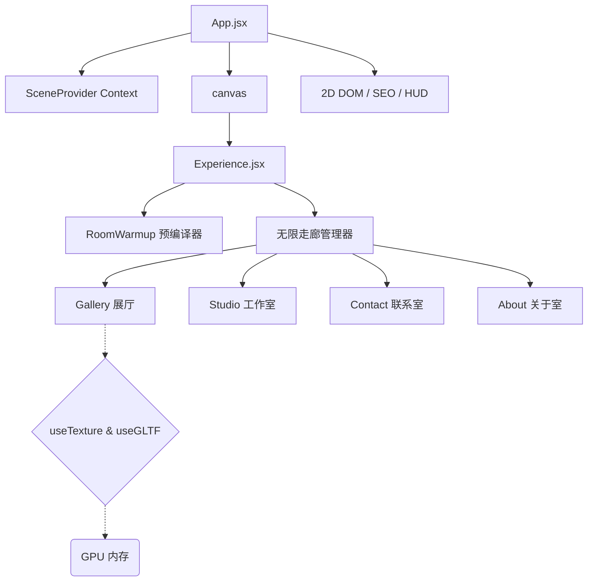

# 🎨 ITom Dev | 交互式 3D WebGL 作品集

<div align="center">
  
  
  
  
  
</div>

<br/>

欢迎访问 **Tomasz "ITom" Szmajda** 的交互式 3D 前端开发者作品集开源仓库。本项目融合了空间级 WebGL 计算、复杂的 React 生态体系以及高度优化的前端工程，旨在突破现代 Web 技术的极限。

> [!NOTE]
> 请确保在浏览器设置中开启硬件加速，以体验本应用流畅的 60 FPS 高画质渲染。

## 🚀 关键性能架构（2026 标准）

本应用针对跨设备可运行性进行了严格的优化，通过多项定制化的架构实现，即使在移动端处理器上也能做到零卡顿：

1. **隐式语义化 SEO 兜底：** 通过策略性的 `sr-only-seo` 索引 DOM 注入，绕过 WebGL 画布的 SEO 限制，在不加载重型打包文件的情况下，向原生搜索引擎爬虫渲染完整的语义树。
2. **着色器异步编译：** 在隐藏的 `RoomWarmup` Suspense 边界内的预加载阶段强制执行 `gl.compileAsync`。这使 Three.js 能够异步预编译复杂材质，而不会阻塞 React 主更新线程。
3. **烘焙式全局着色与光照提取：** 用烘焙的全局纹理（`apply_global_tint.js`）替代实时 WebGL 阴影贴图与无限光线，在保持视觉景深的同时彻底消除 GPU 计算开销。
4. **绕过 DOM 变更：** 关键动画属性（如追踪 130+ 并发 HTTP 纹理请求的 SVG 预加载状态）直接写入 `ref.current.style`，刻意绕过 React 的 `setState` 渲染周期以节约 CPU。
5. **自适应设备分级：** 自动检测 `navigator.deviceMemory`、硬件并发数与视口尺寸，实时调整 WebGL 分辨率（`dpr`）、抗锯齿算法以及纹理加载的严格程度。

---

## 🏗️ 3D 场景架构



---

## 🛠️ 本地开发环境搭建

要在本地原生运行本应用：

1. **克隆仓库：**
   ```bash
   git clone https://github.com/ITomPoland/portfolio-itom.git
   cd portfolio-itom
   ```

2. **安装依赖：**
   请确保你的 Node.js 版本在 v20 及以上。
   ```bash
   npm install
   ```

3. **启动本地开发服务器：**
   ```bash
   npm run dev
   ```

> [!IMPORTANT]
> 由于本项目大量使用了 `vite-plugin-compression` 以及数百张高清纹理，初次本地加载时开发服务器缓冲资源交付可能需要几秒钟。进行性能测试时，请始终运行 `npm run build && npm run preview`。

## 🤝 贡献与反馈

我们欢迎所有能够改进着色器物理效果、3D 数学逻辑或组件记忆化运行时性能的 PR。提交时请参考我们新增的 `.github` Issue 与 Pull Request 模板！

1. Fork 本仓库
2. 创建你的功能分支（`git checkout -b feature/AmazingRoom`）
3. 提交你的修改（`git commit -m 'feat: 为 Contact 室添加真实液体模拟'`）
4. 推送分支（`git push origin feature/AmazingRoom`）
5. 发起 Pull Request

---

## 许可证

本仓库中的代码基于 [MIT 许可证](LICENSE) 开放。  
**注意：** 所有个人素材、3D 纹理、图片及文案版权均归 Tomasz Szmajda 所有，未经明确许可不得复用或转载。

---

*由 [Tomasz Szmajda (ITom Dev)](https://itomdev.com) 设计与开发。*
